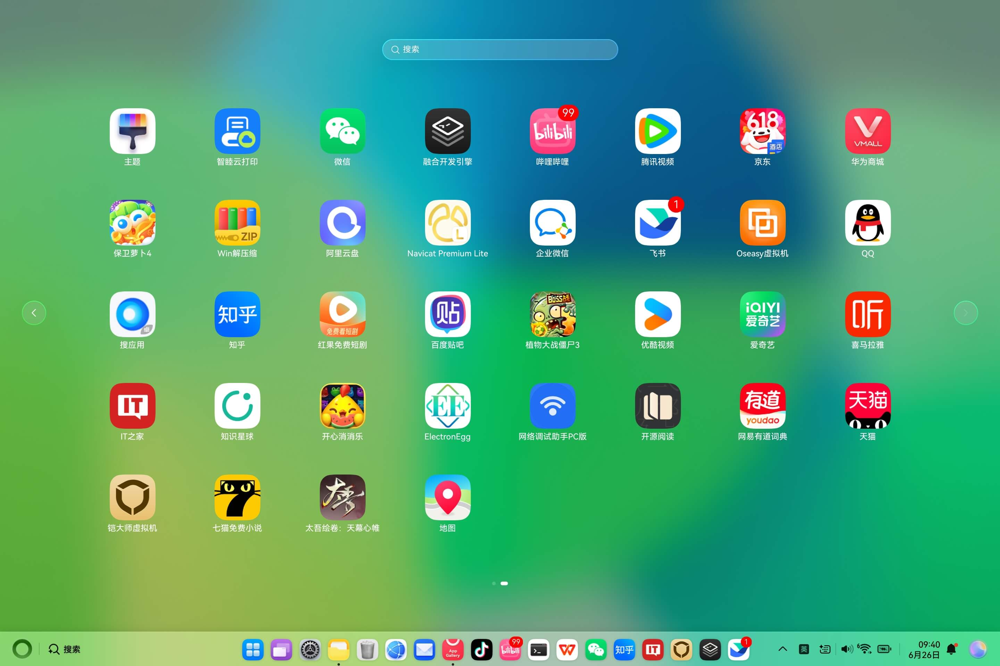
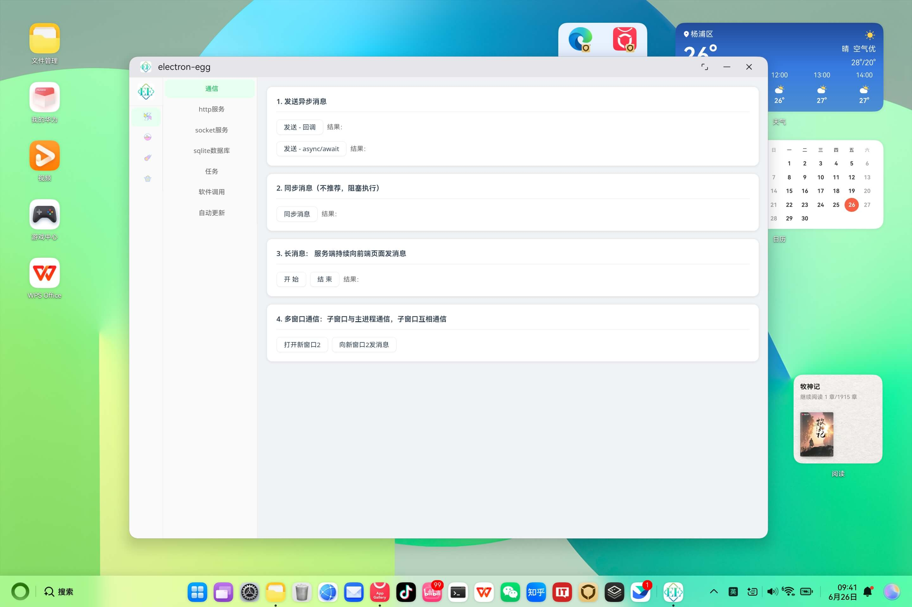
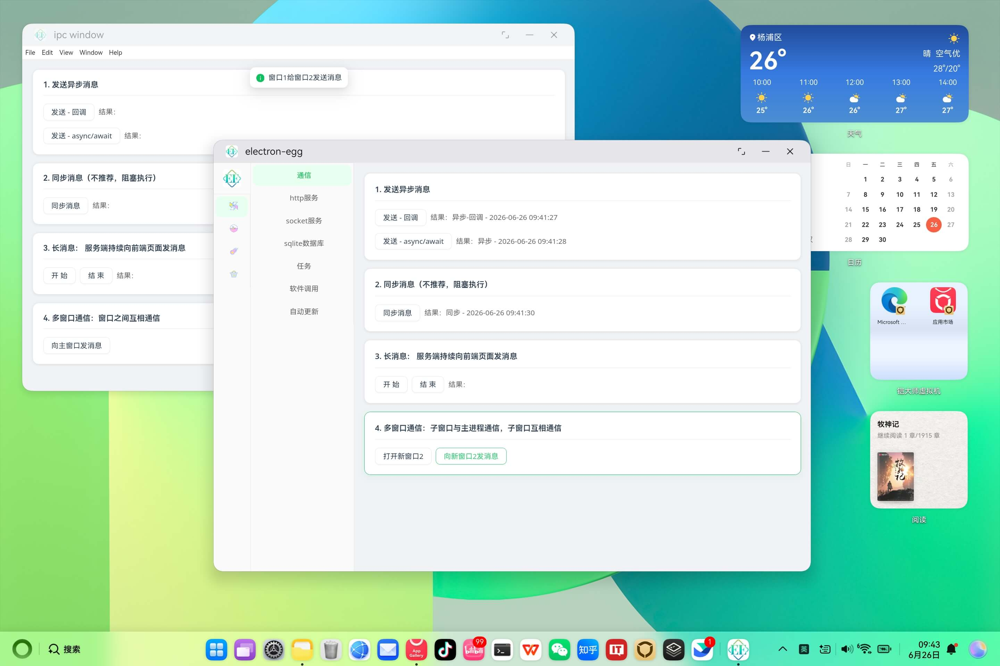
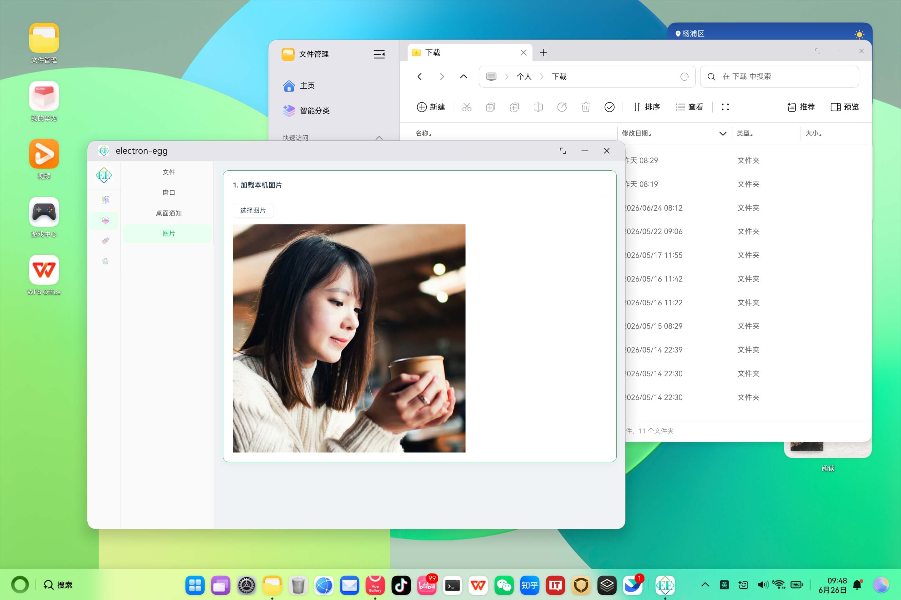
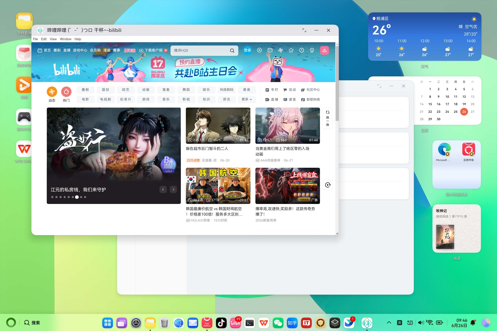

# ElectronEgg: 桌面开发框架全新升级，轻松开发鸿蒙应用

> 一套代码，打包 Windows、Mac、Linux，现在还能直接跑在鸿蒙（HarmonyOS）上。ElectronEgg v5 带着鸿蒙支持来了。

## 写在前面

[ElectronEgg](https://github.com/dromara/electron-egg) 自 2020 年开源以来，一直的愿景很简单：**让所有开发者都能学会桌面软件研发**。它把前端、服务端的工程化思维带进桌面开发，用一套清晰的 controller / service / preload 分层架构，把 Electron 的复杂度封装起来。目前框架在全网已累计 **8000+ Star**，经过大量团队长期实践验证，请放心使用。

v5 版本在此基础上完成了一次全新升级，最重磅的能力之一，就是——**轻松开发鸿蒙应用**。

## 鸿蒙支持：一套代码，跑在 HarmonyOS 上

过去，把 Electron 应用搬到鸿蒙上几乎是一件"重新写一遍"的事。v5 把构建产物自动提取并拷贝到 HarmonyOS HAP 的资源目录中，由 HAP 工程的 web 引擎加载。**你现有的 ElectronEgg 业务代码，几乎不用改，就能以鸿蒙应用的形式运行。**

下面是 ElectronEgg 的 demo 应用在 HarmonyOS 上的真实运行效果：

▲ demo 应用已安装到鸿蒙系统中（包名 `com.electronegg.demo`）

▲ 应用启动，进入首页

▲ 框架功能演示：通信、控制器、服务等能力在鸿蒙端正常工作

▲ 操作系统相关功能演示

▲ 视觉效果与硬件相关功能演示

可以看到，原本在 Windows / Mac 上运行的桌面应用，在鸿蒙端从安装到各项功能都跑得很顺畅。这就是 v5 鸿蒙支持想表达的核心：**跨端不再是口号，鸿蒙是一等公民。**

## v5 还升级了什么

除了鸿蒙支持，v5 对框架内核做了一次较为彻底的重构：

- **ee-core 内核重构**：config、controller、jobs、core、cross、message、storage、socket、loader 等模块全面整理，API 更清晰，同时支持 CJS 与 ESM。
- **更现代的工程化**：TypeScript 优先，构建链升级，开发体验更顺滑。

## 谁适合用

- 想用前端技术栈（Vue / React / HTML）做桌面软件的开发者
- 需要把内部工具、管理后台、办公软件交付为桌面应用团队
- 要同时覆盖 Windows、Mac、Linux，**以及鸿蒙**的产品
- 希望降低 Electron 上手成本、想要一套清晰架构的团队

无论你是前端、服务端、运维还是客户端开发者，都能很快入门。

## 写在最后

桌面软件（办公方向、个人工具）仍然是未来十几年 PC 端的刚需之一。ElectronEgg 想做的，是让这件事变得简单——而现在，这份"简单"也延伸到了鸿蒙。

框架已广泛应用于记账、政务、企业、医疗、学校、股票交易、ERP、娱乐、视频等领域的客户端，欢迎放心使用。

::: tip 开源与社区
- GitHub：[ElectronEgg](https://github.com/dromara/electron-egg)
- Gitee：[ElectronEgg](https://gitee.com/dromara/electron-egg)
:::

如果对你有帮助，欢迎 Star 支持，也欢迎加入社区一起交流。
